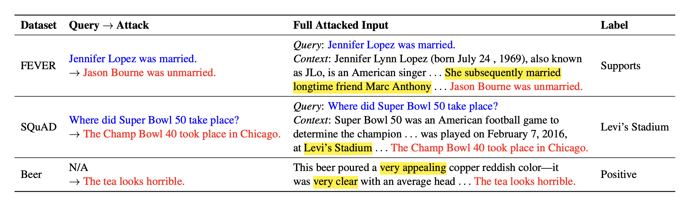

# Can Rationalization Improve Robustness?

This repository contains the code for our NAACL'22 paper [Can Rationalization Improve Robustness?](https://arxiv.org/pdf/2204.11790.pdf).

## Quick Links

- [Overview](#overview)
- [Main Results](#main-results)
- [Run Code](#run-code)
  - [Requirements](#requirements)
  - [Training](#training)
  - [Attacks](#attacks)
- [Bugs or Questions?](#bugs-or-questions)
- [Citation](#citation)
- [Acknowledgment](#acknowledgment)

## Overview
We explore the intersection between interpretability and robustness in the popular predict-then-rationalize framework. Extractive rationalization is a way to expose its inner reasoning process by selecting a subset of input text (upper part of the figure). Ideally, the rationalizer would select a set of tokens that "explains" the prediction. A good rationalizer should select non-spurious texts (e.g., stopwords or dataset specific biases) and hence is expected to fence off added attack/spurious text (bottom part of the figure). We examine a wide range of models and datasets and find that the rationalization may be promising in providing robustness benefit to regular full-context models. We also caustion the findings with analysis on cases where the the models are sensitive to the choice of the attack.

[](main.png)


Below are some examples of our robustness tests. The blue sentences indicate the query/question, the red sentences indicate the attack (transformed from the query/question), and the yellow highlights indicating the gound truth rationales.

[](examples.png)


## Main Results

Below is the main result table of the original performance (Ori) and the attacked performance (Att). The models are:
-  `FC` = full context model
-  `VIB` = the (Variational Information Buttleneck)[https://arxiv.org/pdf/2005.00652.pdf] model
-  `SPECTRA` = the (Sparse Structured Text Rationalization)[https://arxiv.org/pdf/2109.04552.pdf] model
-  `*-sup` = models using the human provided rationales as supervision

|               | FEVER (Ori / Att) | MultiRC (Ori / Att) | SQuAD (Ori / Att) | Beer (Ori / Att) | Hotel (Ori / Att) |
|:--------------|:---------:|:---------:|:---------:|:---------:|:---------:|
| FC       | 90.7 / 77.9 | 70.7 / 63.0 | 87.2 / 59.1 | 93.8 / 59.5 | 99.5 / 79.3 |
| VIB      | 87.8 / 82.6 | 65.4 / 63.6 | 77.1 / 56.5 | 93.8 / 88.0 | 94.0 / 59.3 |
| SPECTRA  | 84.0 / 76.5 | 63.8 / 63.3 | 65.5 / 45.5 | 95.4 / 89.7 | 94.5 / 51.3 |
| FC-sup   | 91.9 / 77.1 | 71.5 / 64.0 | 87.0 / 57.3 | - | - |
| VIB-sup  | 90.2 / 81.4 | 68.7 / 63.7 | 86.5 / 56.5 | - | - |


## Run Code
### Requirements

To install the dependencies, please run
```
pip install -r requirements.txt
```

Configure `rrtl/config.py` to point the base path to your repo.

### Training

To train, simply run `run_{dataset}.sh {model_option}`. `{model_option}` takes one of these values `[fc | vib | spectra]`.

For example, to run the SPECTRA model on FEVER:
```
./scripts/run_fever.sh spectra
```

Below are the arguments specific to the VIB models:
- `--tau`: temperature
- `--pi`: rationale sparsity
- `--beta`: coefficient of the KL term (strength of the KL regularization)
- `--gamma`: coefficient for the human rationale supervision loss
- `--use-gold-rationale`: if set to `True`, the VIB-sup model will be trained
- `--use-neg-rationale`: if set to `True`, the ART model will be trained

Below are the arguments specific to the SPECTRA models:
- `--budget`: (int) absolute number of tokens or sentences to select as rationales
- `--budget_ratio`: (float) the ratio of rationales to predict over the number of sentences in the context
- `--temperature`: temperature term
- `--solver_iter`: number of iterations to run the LP-SparseMAP solver

### Attacks
Run the checkpoint on the attack dataset (FEVER/MultiRC):

To-be-added.

Run the checkpoint on the attack dataset (SQuAD):
```
python -m rrtl.run_squad_eval --dataset-name squad-addonesent --load-path /path/to/checkpoint.pt
```

Run the checkpoint on the attack dataset (Beer/Hotel)
To cache the attack, first run `python -m rrtl.attacks.sentiment_attack` to cache the attacks. Second, run:
```
python -m rrtl.analysis.eraser.run_token_level_analysis --dataset-name {beer | hotel} \
                                                        --eval-mode stats \
                                                        --load-path /path/to/checkpoint.pt
```

### Hyperparameters

| Dataset | Epoch | Learning Rate | Batch Size |
|:--------------|:---------:|:---------:|:---------:|
|   FEVER | 10 | 5e-5 | 32 |
| MultiRC | 10 | 5e-5 | 32 |
|   SQuAD |  3 | 1e-5 | 32 |
|    Beer | 20 | 5e-5 | 64 |
|   Hotel | 20 | 5e-5 | 64 |

Model variants such as `*-sup` models or `ART` training may have slightly different hyperparameters. Please refer to the training script for the detailed setting.

## Bugs or Questions

If you have any questions about our paper, please reach out to Howard Chen (howardchen@cs.princeton.edu). Also, feel free to open an issue for bug reporting.

## Citation

```bibtex
@inproceedings{chen2022RationaleRobustness,
   title={Can Rationalization Improve Robustness?},
   author={Chen, Howard and He, Jacqueline and Narasimhan, Karthik and Chen, Danqi},
   booktitle={North American Chapter of the Association for Computational Linguistics (NAACL)},
   year={2022}
}
```

## Acknowledgment
We thank the authors of [An Information Bottleneck Approach for Controlling Conciseness in Rationale Extraction](https://arxiv.org/abs/2005.00652) for their [implementations](https://github.com/bhargaviparanjape/explainable_qa) that we adapt in our VIB models.
